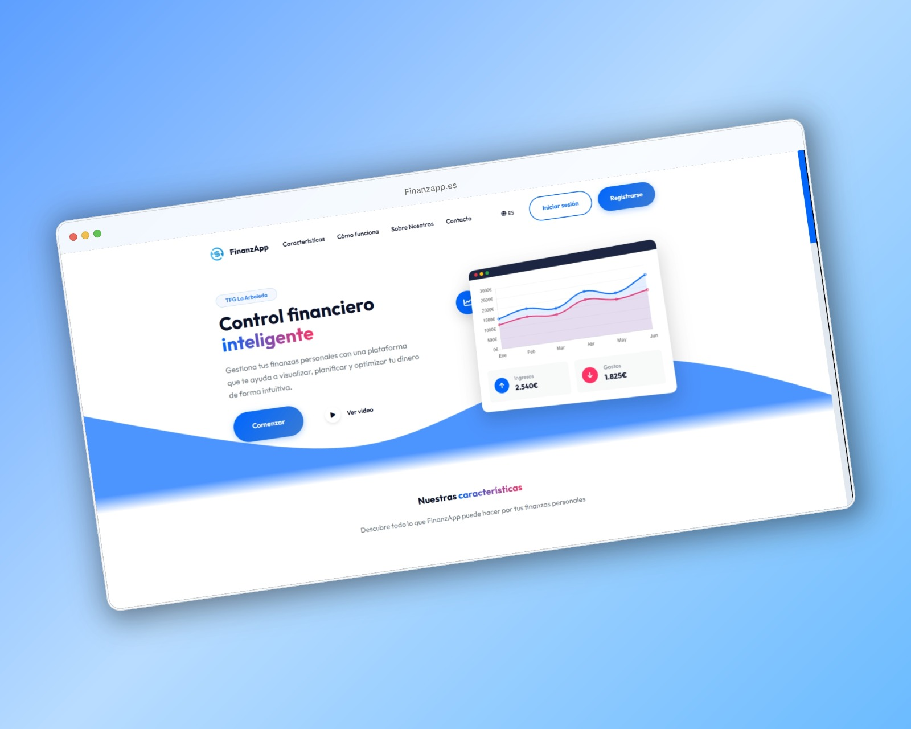
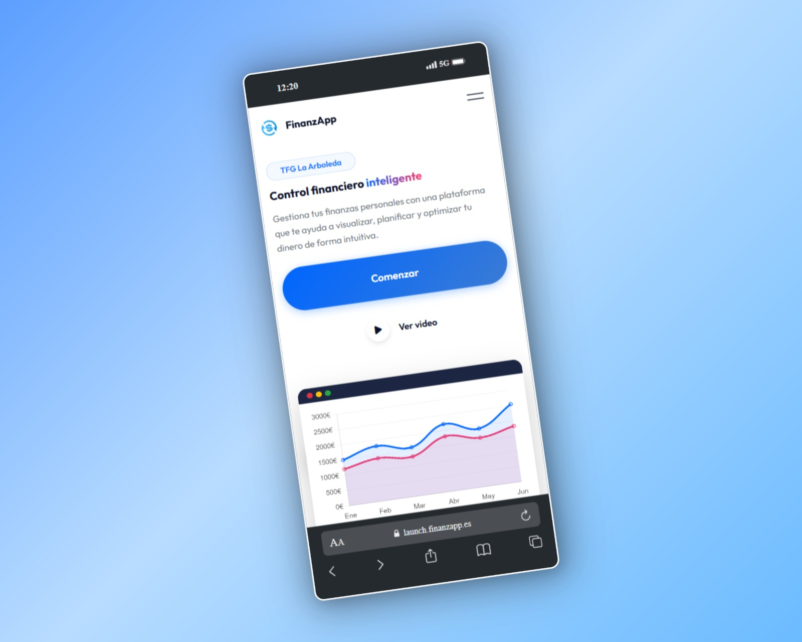

  <!-- Logo officiel -->
  

  <!-- Sélecteur de langue -->
  <h3>🌐 Changer de langue / Change Language / Cambiar idioma</h3>
  

    
    
    
  

  <!-- Badges -->
  

    
    
    
    
    
    
  

> ⚠️ **Remarque :** Ce projet a été développé dans le cadre du **Travail de Fin d’Études (Thèse Finale)** à l’IES La Arboleda 🌲

---

## 🚀 Démo en ligne

Vous pouvez essayer l’application directement ici (en français):  
🔗 [https://launch.finanzapp.es/](https://launch.finanzapp.es/?lang=fr)

---

## 📑 Sommaire

- [Introduction](#🧠-introduction)
- [Fonctionnalités](#🌟-fonctionnalités)
- [Galerie](#🖼️-galerie)
- [Stack Technologique](#🛠️-stack-technologique)
- [Métriques du Projet](#📊-métriques-du-projet)
- [Documentation](#📚-documentation)
- [Équipe](#🧑‍💻-équipe)
- [Licence](#📄-licence)

---

## 🧠 Introduction

**FinanzApp** est une plateforme web intelligente de gestion financière, développée comme projet de fin d’études à l’IES La Arboleda.  
L’application propose des outils complets pour la gestion de l’épargne, des investissements et des cryptomonnaies, combinant sécurité avancée et analyses détaillées dans une interface intuitive et responsive.

---

## 🌟 Fonctionnalités

🔐 **Authentification Sécurisée**  
- Inscription et connexion avec reCAPTCHA v3  
- Protection contre les attaques par force brute  

💼 **Gestion Financière Complète**  
- 💰 Épargne intelligente avec suivi des objectifs  
  - Visualisation des progrès avec graphiques  
  - Alertes lorsque les objectifs sont atteints  
- 📈 Investissements avec analyse détaillée  
  - Rendement historique (ROI, gains/pertes)  
  - Comparaison avec des indices de référence  
- ₿ Cryptomonnaies en temps réel  
  - Cotations mises à jour  
  - Calculateur de conversion intégré  

🤖 **Automatisation Avancée**  
- Résumé automatique des mouvements  
- Catégorisation intelligente des transactions  
- Exportation des données en CSV, PDF et Excel  

📊 **Tableau de Bord Interactif**  
- Graphiques personnalisables (Chart.js)  
- Widgets configurables  
- Vue mobile responsive  

✉️ **Système de Notifications**  
- Alertes par email (EmailJS)  
- Rappels personnalisables  

---

## 🖼️ Galerie

  
  
  
  

---

## 🛠️ Stack Technologique

**Frontend :**  
- ⚛️ React  
- 🎨 JavaScript  

**Backend :**  
- 🐘 PHP  
- 🗃️ MySQL  

**APIs Intégrées :**  
- 📑 Resend (analyse financière)  
- 🛡️ reCAPTCHA (sécurité)  
- ✉️ EmailJS (notifications)  

**DevOps :**  
- 🛠️ GitHub Actions (CI/CD)  
- 🔍 SonarCloud (qualité du code)  
- 📋 Jira (gestion agile)  

---

## 📊 Métriques du Projet

- 
- 

---

## 📚 Documentation

- 📘 [Documentation API](https://github.com/Ballwictb/FinanzApp/wiki/API-Documentation)  
- 🛠️ [Guide d’installation](https://github.com/Ballwictb/FinanzApp/wiki/Installation-Guide)

---

## 🧑‍💻 Équipe

|  |  |  |
| :----------------------------------------------------------------------------------------------------------------------------------------------------------------------------------------------------------------------------------------------------: | :-------------------------------------------------------------------------------------------------------: | :-------------------------------------------------------------------------------------------------------: |
|                                                                                                    [Roberto Ortiz](https://github.com/Robertort1z)                                                                                                     |                                [Jamal Rabah](https://github.com/Ballwictb)                                |                              [Israel Soriano](https://github.com/IsraC0d33)                               |

---

## 📄 Licence

Ce projet est sous licence [MIT](./docs/LICENSE).  
Vous êtes libre de l'utiliser, le modifier et le distribuer tant que vous conservez les crédits originaux.

---

  © 2025 FinanzApp

